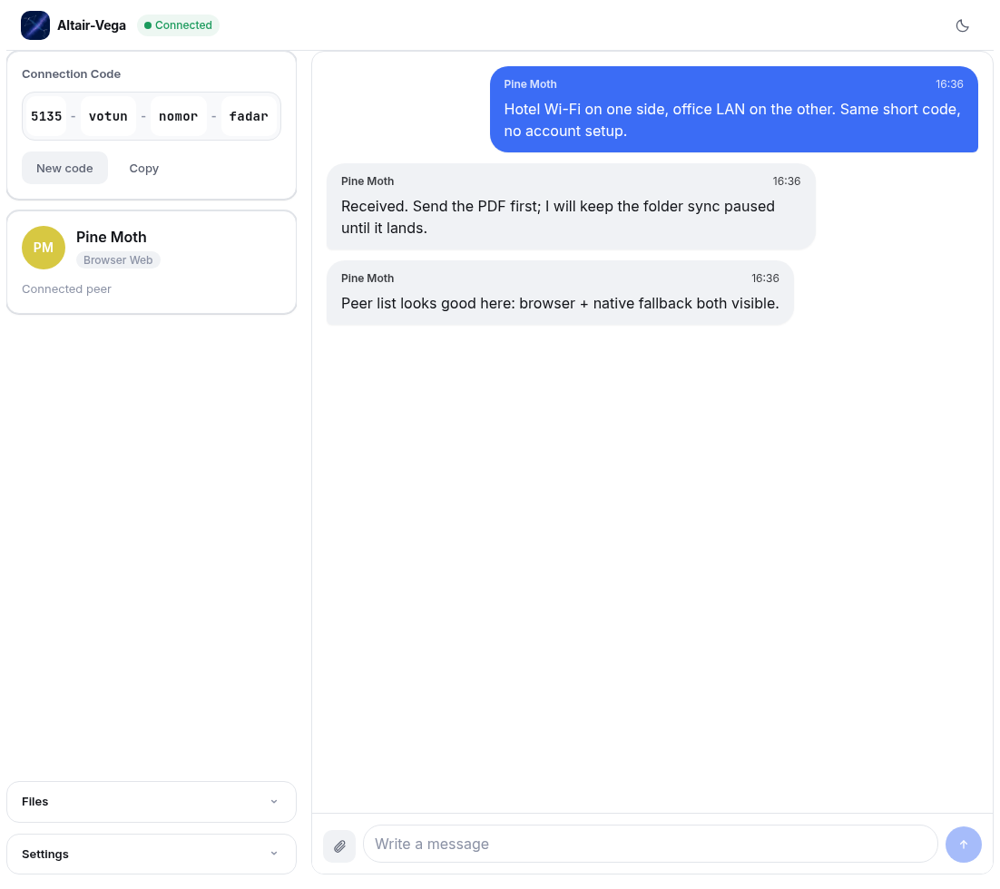
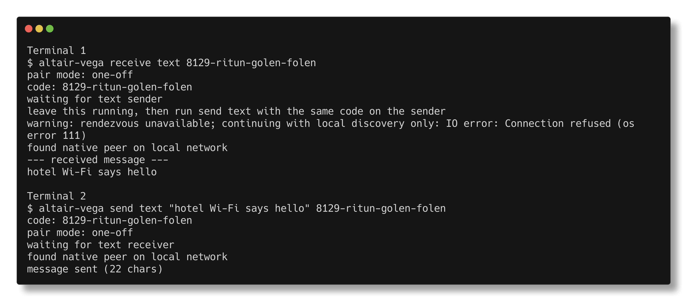

<p align="center">
  
</p>

<h1 align="center">Altair-Vega | 鹊桥</h1>

<p align="center">
  <em>An opinionated take on file transfer.</em>
</p>

<p align="center">
  <a href="https://github.com/EL-File4138/Altair-Vega/actions/workflows/ci.yml"></a>
  <a href="https://github.com/EL-File4138/Altair-Vega/releases"></a>
  <a href="LICENSE"></a>
  
</p>

<p align="center">
  
</p>

Altair-Vega is a peer-to-peer transfer tool for moving messages, files, and synced folder state across isolated networks that only share common Internet access. The goal is simple: get files from where they are to where they should be, with minimal ceremony around accounts, hosting, and setup.

It uses [iroh](https://www.iroh.computer/) for direct peer connectivity and short human-typable codes for fast manual pairing without persistent user accounts. The native CLI and browser app are both first-class peers, while the rendezvous service is limited to discovery/signaling and does not store transferred content.

| Browser peer workspace | Disposable CLI session |
| --- | --- |
|  |  |

## Quick Start

Run the latest release through the disposable launcher:

```sh
curl -fsSL https://raw.githubusercontent.com/EL-File4138/Altair-Vega/main/scripts/startup.sh | sh -s -- help
```

The launcher detects Linux/macOS and CPU architecture, downloads the matching latest release binary into a temporary runtime workspace, runs it, and cleans up when it exits.

Send a text message from one machine:

```sh
curl -fsSL https://raw.githubusercontent.com/EL-File4138/Altair-Vega/main/scripts/startup.sh | sh -s -- send text "hello from Altair-Vega"
```

Receive from another machine with the printed code:

```sh
curl -fsSL https://raw.githubusercontent.com/EL-File4138/Altair-Vega/main/scripts/startup.sh | sh -s -- receive text <CODE>
```

Expected result: the receiver prints the transferred message after pairing through same-LAN discovery or short-code rendezvous fallback.

Cross-platform launcher forms:

- **Linux/macOS:** `curl -fsSL https://raw.githubusercontent.com/EL-File4138/Altair-Vega/main/scripts/startup.sh | sh -s -- <altair-vega args>`
- **Windows PowerShell:** `& ([scriptblock]::Create((irm 'https://raw.githubusercontent.com/EL-File4138/Altair-Vega/main/scripts/startup.ps1'))) -- <altair-vega args>`
- **Custom repo/binary:** set `ALTAIR_VEGA_GITHUB_REPO=<OWNER>/<REPO>`, or pass `--url <binary-url>` / `-Url <binary-url>`.

## Features

- Send text messages between paired peers.
- Send and resume file transfers between native and browser peers.
- Sync a native folder between two peers with explicit bidirectional `--join` mode.
- Prefer native same-LAN discovery when available, with short-code rendezvous as fallback.
- Run the native CLI from disposable launcher scripts with RAM-first runtime state where available.
- Use raw `iroh` tickets with `--naked` when bypassing short-code rendezvous is preferred.

## Use Cases

- Move a message or file between two machines that cannot see each other directly but can reach the Internet.
- Pair a native CLI with a browser session for ad hoc file receive workflows.
- Keep a folder synchronized between two native peers during a controlled two-peer session.
- Run a disposable native binary without installing long-lived application state on the host.

## Usage And Docs

Use `altair-vega help` for the complete command manual. For common work, start with these workflows:

- **Pair two peers:** run `altair-vega pair` on the first machine, then `altair-vega pair <CODE>` on the second.
- **Send text:** run `altair-vega send text "hello"`, then run `altair-vega receive text <CODE>` on the receiver.
- **Send a file:** run `altair-vega send file ./photo.jpg`, then run `altair-vega receive file <CODE> --output-dir ./downloads`.
- **Sync a folder read-only:** run `altair-vega sync ./source` on the host, then `altair-vega sync ./copy <CODE>` on the follower.
- **Sync a folder both ways:** run `altair-vega sync ./folder` on the host, then `altair-vega sync --join ./folder <CODE>` on the second peer.
- **Bridge a browser session:** open the hosted web app, copy its code, then run `altair-vega serve browser-peer <CODE>`.
- **Host your own web app:** follow `DEPLOYMENT.md` to deploy the static frontend and rendezvous Worker.
- **Develop locally:** follow `DEVELOPMENT.md` for setup, builds, validation, and project structure.
- **Contribute:** follow `CONTRIBUTING.md` for scope, PR expectations, and commit style.

## Configuration

Altair-Vega saves the latest short code or naked ticket in `.altair-pair/pair-state.json`, under the runtime state root when `ALTAIR_VEGA_RUNTIME_ROOT` is set. Commands that omit `CODE` or a naked ticket reuse that state when possible.

The default rendezvous URL is compiled into the binary. Set `ALTAIR_VEGA_DEFAULT_RENDEZVOUS=<URL>` at build time to change the native default, or pass `--room-url <URL>` at runtime.

Browser builds use `VITE_DEFAULT_RENDEZVOUS_URL` at build time. See `.env.example` for safe placeholder values.

## Disposable Native Launcher

Altair-Vega has a shared disposable-runtime contract in the Rust core plus platform launchers that feed it.

Launcher behavior:

- The POSIX launcher chooses `XDG_RUNTIME_DIR`, then `/dev/shm`, then the system temp directory.
- The PowerShell launcher chooses the Windows temp directory unless `-RuntimeParent` is provided.
- Sets `ALTAIR_VEGA_RUNTIME_ROOT` and `TMPDIR` for the launched process so default internal state can stay RAM-first when possible.
- Removes the fetched executable and runtime workspace on exit by default.
- Supports `--keep-runtime` or `-KeepRuntime` when you need to inspect the temp workspace after exit.

## Contributing

See `CONTRIBUTING.md`. During release hardening, product functionality is frozen; changes should be limited to bug fixes, validation shorthand, packaging, release automation, and documentation.

## Roadmap

- Current focus: release hardening, deployment readiness, platform validation, and artifact preparation.
- Deferred: multi-peer/N-way bidirectional sync.
- Deferred: browser WebRTC/local discovery until the relevant `iroh` transport APIs are stable enough for release use.

## Status

This repository is pre-release. The functionality baseline is frozen while release hardening, deployment readiness, and platform validation are completed.

## Verifying Downloads

Release artifacts include SHA-256 checksum files. After downloading a binary and its checksum file, verify it before running:

```sh
sha256sum -c altair-vega-linux-x86_64.sha256
```

Release bundles also include `SHA256SUMS` manifests for checking grouped artifacts:

```sh
sha256sum -c SHA256SUMS
```

## License

Altair-Vega is licensed under the BSD 3-Clause License. See `LICENSE` for details.
